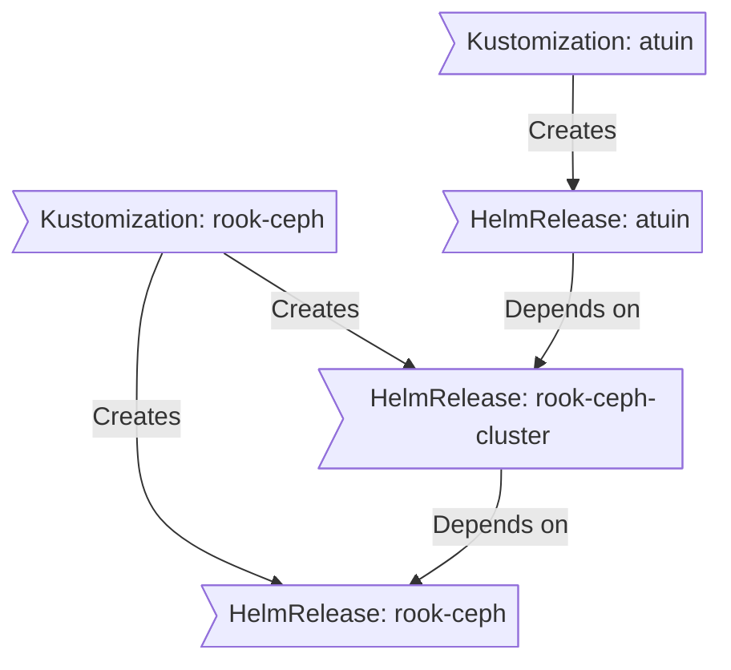

<div align="center">


###  Home Operations Repository 

_managed with Flux, Renovate, and GitHub Actions_ 

</div>

<div align="center">

[](https://discord.gg/home-operations)&nbsp;&nbsp;
[](https://talos.dev)&nbsp;&nbsp;
[](https://kubernetes.io)&nbsp;&nbsp;
[](https://fluxcd.io)&nbsp;&nbsp;
[](https://github.com/thomloy/home-ops/actions/workflows/renovate.yaml)

</div>

<div align="center">

[](https://homelab-badges.kryzaleh.workers.dev/s/)&nbsp;&nbsp;
[](https://homelab-badges.kryzaleh.workers.dev/s/)&nbsp;&nbsp;
[](https://homelab-badges.kryzaleh.workers.dev/s/)

</div>

<div align="center">

[](https://github.com/kashalls/kromgo)&nbsp;&nbsp;
[](https://github.com/kashalls/kromgo)&nbsp;&nbsp;
[](https://github.com/kashalls/kromgo)&nbsp;&nbsp;
[](https://github.com/kashalls/kromgo)&nbsp;&nbsp;
[](https://github.com/kashalls/kromgo)&nbsp;&nbsp;
[](https://github.com/kashalls/kromgo)&nbsp;&nbsp;
[](https://github.com/kashalls/kromgo)&nbsp;&nbsp;
[](https://github.com/kashalls/kromgo)

</div>

---

##  Overview

Welcome to my home operations repository — a mono repository for my home infrastructure and Kubernetes cluster. The cluster runs on [Talos Linux](https://www.talos.dev/) and follows Infrastructure as Code (IaC) and GitOps practices using [Ansible](https://www.ansible.com/), [Flux](https://github.com/fluxcd/flux2), [Renovate](https://github.com/renovatebot/renovate), and [GitHub Actions](https://github.com/features/actions). Application state is backed up to [Cloudflare R2](https://www.cloudflare.com/products/r2/) via [CloudNativePG](https://cloudnative-pg.io/) for continuous PostgreSQL WAL archiving, and [VolSync](https://github.com/backube/volsync) + [Kopia](https://kopia.io/) for PVC snapshots. Secrets are encrypted at rest with [SOPS](https://github.com/getsops/sops) and [Age](https://github.com/FiloSottile/age).

---

##  Kubernetes

My Kubernetes cluster is deployed with [Talos](https://www.talos.dev). This is a semi-hyper-converged cluster, workloads and block storage are sharing the same available resources on my nodes while I have a separate server with ZFS for NFS/SMB shares, bulk file storage and backups.

### Core Components

- **Networking & Service Mesh**: [cilium](https://github.com/cilium/cilium) provides eBPF-based networking with BGP integration to the OPNsense router (jumbo frames MTU 9000), while [istio](https://istio.io/latest/) handles service-to-service traffic with L7 proxying. [envoy-gateway](https://gateway.envoyproxy.io/) exposes HTTP routes, [cloudflared](https://github.com/cloudflare/cloudflared) secures public ingress via a Cloudflare Tunnel (no open ports), [external-dns](https://github.com/kubernetes-sigs/external-dns) keeps DNS records in sync, and [Tailscale](https://tailscale.com/) provides a personal mesh VPN for admin access.
- **Security & Secrets**: [cert-manager](https://github.com/cert-manager/cert-manager) automates TLS certificate management with Let's Encrypt. Secrets are pulled from [1Password](https://1password.com/) by [external-secrets](https://github.com/external-secrets/external-secrets) and sensitive Git-tracked files are encrypted with [sops](https://github.com/getsops/sops) + [age](https://github.com/FiloSottile/age). Pods are enforced non-root with `readOnlyRootFilesystem`, `RuntimeDefault` seccomp, and dropped capabilities.
- **Storage & Data Protection**: [rook-ceph](https://github.com/rook/rook) provides distributed RBD block storage (3-way replication) for stateful workloads, [openebs](https://openebs.io/) handles local ephemeral volumes, and the NAS exposes bulk NFS shares. PostgreSQL clusters run under [cloudnative-pg](https://cloudnative-pg.io/) with continuous WAL archiving and base backups to a [Cloudflare R2](https://www.cloudflare.com/products/r2/) bucket (`s3://cnpg-backups/<cluster>`, bzip2-compressed). PVC data is snapshot-backed up with [volsync](https://github.com/backube/volsync) + [kopia](https://kopia.io/) to a separate R2 bucket, with a 7-day retention policy. [spegel](https://github.com/spegel-org/spegel) runs a stateless cluster-local OCI image mirror to keep pulls fast and resilient.
- **Observability**: [kube-prometheus-stack](https://github.com/prometheus-community/helm-charts/tree/main/charts/kube-prometheus-stack) + [Grafana](https://grafana.com/) for metrics and dashboards, [Victoria Logs](https://victoriametrics.com/products/victorialogs/) shipped by [Fluent Bit](https://fluentbit.io/) for log aggregation, [Gatus](https://github.com/TwiN/gatus) for synthetic HTTP probes on every app, with alerts routed to Pushover.
- **Automation & CI/CD**: [Renovate](https://github.com/renovatebot/renovate) opens PRs for dependency updates (auto-merging minor/patch on Mise and GitHub Actions). [flux-local](https://github.com/allenporter/flux-local) validates Flux manifests and posts the cluster diff on every PR. [actions-runner-controller](https://github.com/actions/actions-runner-controller) runs self-hosted GitHub Actions runners directly in the cluster.

### GitOps

[Flux](https://github.com/fluxcd/flux2) watches the clusters in my [kubernetes](./kubernetes/) folder (see Directories below) and makes the changes to my clusters based on the state of my Git repository.

The way Flux works for me here is it will recursively search the `kubernetes/apps` folder until it finds the most top level `kustomization.yaml` per directory and then apply all the resources listed in it. That aforementioned `kustomization.yaml` will generally only have a namespace resource and one or many Flux kustomizations (`ks.yaml`). Under the control of those Flux kustomizations there will be a `HelmRelease` or other resources related to the application which will be applied.

[Renovate](https://github.com/renovatebot/renovate) watches my **entire** repository looking for dependency updates, when they are found a PR is automatically created. When some PRs are merged Flux applies the changes to my cluster.

### Directories

This Git repository contains the following directories under [Kubernetes](./kubernetes/).

```sh
📁 kubernetes
├── 📁 apps       # applications
├── 📁 components # re-useable kustomize components
└── 📁 flux       # flux system configuration
📁 ansible
├── 📁 inventory  # hosts and group_vars
└── 📁 playbooks  # bootstrap, nas, network
📁 talos          # Talos OS node configurations
📁 templates      # Jinja2 templates (makejinja)
```

### Flux Workflow

This is a high-level look how Flux deploys my applications with dependencies. In most cases a `HelmRelease` will depend on other `HelmRelease`'s, in other cases a `Kustomization` will depend on other `Kustomization`'s, and in rare situations an app can depend on a `HelmRelease` and a `Kustomization`. The example below shows that `atuin` won't be deployed or upgrade until the `rook-ceph-cluster` Helm release is installed or in a healthy state.



### Networking

<details>
  <summary>Click here to see my high-level network diagram</summary>

  
</details>

---

##  Cloud Dependencies

A few external services fill gaps the cluster can't cover itself: secrets must exist before the cluster boots (1Password via External Secrets), CI runs outside to avoid circular dependencies (GitHub Actions), alerts need a delivery path independent of cluster health (Pushover), and the public domain is managed externally.

| Service                                   | Use                                                                                                                                                                       | Cost          |
|-------------------------------------------|---------------------------------------------------------------------------------------------------------------------------------------------------------------------------|---------------|
| [1Password](https://1password.com/)       | Secrets with [External Secrets](https://external-secrets.io/)                                                                                                             | ~€65/yr       |
| [Cloudflare](https://www.cloudflare.com/) | Public DNS, [Tunnel](https://www.cloudflare.com/products/tunnel/) ingress, and [R2](https://www.cloudflare.com/products/r2/) buckets for CNPG WAL archiving + VolSync repos | ~€1/mo        |
| [GitHub](https://github.com/)             | Hosting this repository and continuous integration/deployments                                                                                                            | Free          |
| [Pushover](https://pushover.net/)         | Kubernetes Alerts and application notifications                                                                                                                           | €5 OTP        |
| Domain                                    | Public domain name                                                                                                                                                        | €10.7/yr      |
|                                           |                                                                                                                                                                           | **Total: ~€7/mo** |

---

##  DNS

In my cluster there are two instances of [ExternalDNS](https://github.com/kubernetes-sigs/external-dns) running. One for syncing private DNS records to my `OPNsense router` using [ExternalDNS webhook](https://github.com/kashalls/external-dns-unifi-webhook), while another instance syncs public DNS to `Cloudflare`. This setup is managed by creating ingresses with two specific classes: `internal` for private DNS and `external` for public DNS. The `external-dns` instances then syncs the DNS records to their respective platforms accordingly.

---

##  Hardware

<details>
  <summary>Click here to see my server rack</summary>

  
</details>

| Device                   | Num | OS Disk Size | Data Disk Size     | Ram  | OS            | Function              |
|--------------------------|-----|--------------|--------------------|------|---------------|-----------------------|
| Minisforum MS-01         | 3   | 256GB SSD    | 3x1TB (rook-ceph)  | 96GB | Talos         | Kubernetes            |
| NAS - N150 Motherboard   | 1   | 1TB SSD      | 4x4TB ZFS          | 16GB | TrueNAS SCALE | NFS + Backup Server   |
| JetKVM                   | 3   | -            | -                  | -    | -             | KVM for Kubernetes    |
| Lenovo m720q             | 1   | 256GB SSD    | -                  | -    | OPNsense      | Router                |
| Mikrotik CRS310-8G+2S+IN | 1   | -            | -                  | -    | -             | 2.5Gb  Switch         |
| EATON 3S 850             | 1   | -            | -                  | -    | -             | UPS                   |

---

##  Stargazers

<div align="center">

<a href="https://www.star-history.com/#thomloy/home-ops&Date">
  
</a>

</div>

---

<div align="center">

[](https://deepwiki.com/thomloy/home-ops)

</div>
